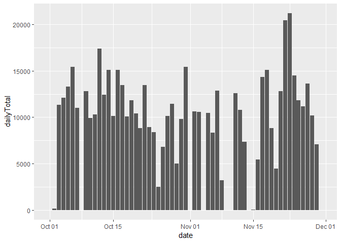
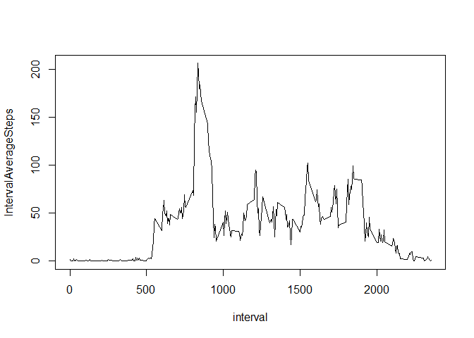
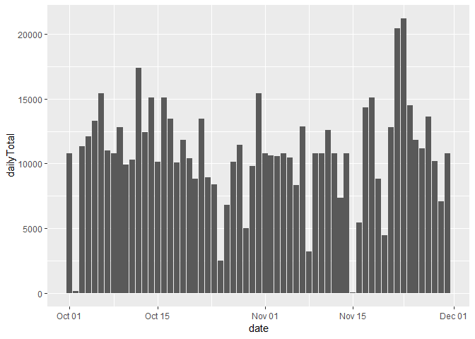
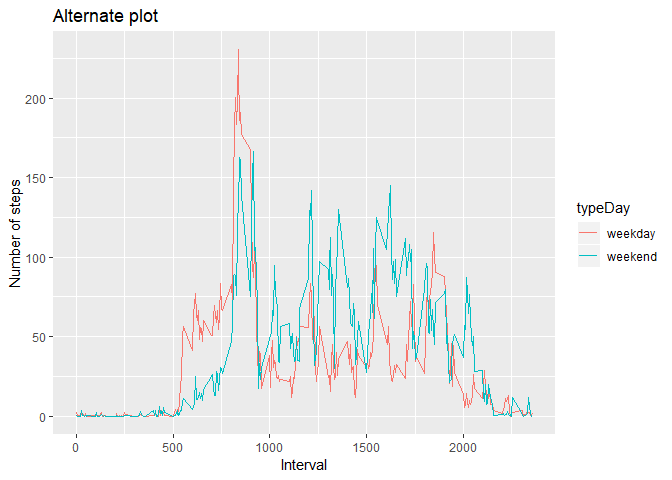

## Loading and preprocessing the data

```r
library(dplyr)
```

```
## 
## Attaching package: 'dplyr'
```

```
## The following objects are masked from 'package:stats':
## 
##     filter, lag
```

```
## The following objects are masked from 'package:base':
## 
##     intersect, setdiff, setequal, union
```

```r
library(ggplot2)

# ensure a clean environment
rm(list=ls())

# 1. load the data
data <- read.table(unz(filename = "activity.csv", description = "activity.zip" ), header= TRUE, sep = ",")

# 2. ETL/prep data
data <- mutate(data, date = as.Date(date))
```

## What is mean total number of steps taken per day?


```r
perDay <- group_by(data, date)
totalStepsPerDay <- summarise(perDay, dailyTotal = sum(steps, na.rm = TRUE))

# 1. Make a histogram of the total number of steps taken each day
ggplot(totalStepsPerDay, aes(x = date, y = dailyTotal)) +
    geom_histogram(stat = "identity")
```

```
## Warning: Ignoring unknown parameters: binwidth, bins, pad
```

<!-- -->

```r
# 2. Calculate and report the mean and median total number of steps taken per day
print (paste("Mean total number of steps per taken day is",  mean(totalStepsPerDay$dailyTotal)))
```

```
## [1] "Mean total number of steps per taken day is 9354.22950819672"
```

```r
print (paste("Median total number of steps per taken day is",  median(totalStepsPerDay$dailyTotal)))
```

```
## [1] "Median total number of steps per taken day is 10395"
```


## What is the average daily activity pattern?

```r
perInterval <- group_by(data, interval)
averageStepsPerInterval <- summarise(perInterval, IntervalAverageSteps = mean(steps, na.rm = TRUE))

# 1. Make a time series plot (i.e. type = "l") of the 5-minute interval (x-axis) and the average number of steps taken, averaged across all days (y-axis)
plot(averageStepsPerInterval, type = "l")
```

<!-- -->

```r
# 2. Which 5-minute interval, on average across all the days in the dataset, contains the maximum number of steps?
print(paste("5-minute interval with max number of steps is interval",  averageStepsPerInterval[averageStepsPerInterval$IntervalAverageSteps ==  max(averageStepsPerInterval$IntervalAverageSteps),]$interval))
```

```
## [1] "5-minute interval with max number of steps is interval 835"
```


## Imputing missing values

```r
# 1. Calculate and report the total number of missing values in the dataset (i.e. the total number of rows with NAs)
print("Missing Value in the dataset:")
```

```
## [1] "Missing Value in the dataset:"
```

```r
colSums(is.na(data))
```

```
##    steps     date interval 
##     2304        0        0
```

```r
#identitfy the records with missing steps
missingRecs <- is.na(data$steps)

# 2. Devise a strategy for filling in all of the missing values in the dataset.
# make synthetic records for missing data based on the rounded average interval values
synthRecords <- subset(mutate(merge(data[missingRecs,], averageStepsPerInterval, by = "interval"), steps=round(IntervalAverageSteps)), select=-c(IntervalAverageSteps))

# 3. Create a new dataset that is equal to the original dataset but with the missing data filled in.
hybridData <- rbind(data[!missingRecs,], synthRecords)
hybridPerDay <- group_by(hybridData, date)
totalHybridStepsPerDay <- summarise(hybridPerDay, dailyTotal = sum(steps, na.rm = TRUE))

# 4. Make a histogram of the total number of steps taken each day and Calculate and report the mean and median total number of steps taken per day. Do these values differ from the estimates from the first part of the assignment? What is the impact of imputing missing data on the estimates of the total daily number of steps?
ggplot(totalHybridStepsPerDay, aes(x = date, y = dailyTotal)) +
    geom_histogram(stat = "identity")
```

```
## Warning: Ignoring unknown parameters: binwidth, bins, pad
```

<!-- -->

```r
print (paste("Mean total number of hybbrid steps per taken day is",  mean(totalHybridStepsPerDay$dailyTotal)))
```

```
## [1] "Mean total number of hybbrid steps per taken day is 10765.6393442623"
```

```r
print (paste("Median total number of hybbrid steps per taken day is",  median(totalHybridStepsPerDay$dailyTotal)))
```

```
## [1] "Median total number of hybbrid steps per taken day is 10762"
```

```r
print("Using the dataset with imputed values for missing data results in higher step mean and median values.")
```

```
## [1] "Using the dataset with imputed values for missing data results in higher step mean and median values."
```


## Are there differences in activity patterns between weekdays and weekends?

```r
# 1. Create a new factor variable in the dataset with two levels - "weekday" and "weekend" indicating whether a given date is a weekday or weekend day.
enhHybridData <- mutate(hybridData, typeDay = factor(1 * weekdays(hybridPerDay$date, TRUE) %in% c("Sat", "Sun"), labels = c("weekday","weekend")), day =weekdays(hybridData$date, TRUE))

# calculate the average steps
hybridPerInterval <- group_by(enhHybridData, interval, typeDay)
hybridAverageStepsPerInterval <- summarise(hybridPerInterval, IntervalAverageSteps = mean(steps, na.rm = TRUE))


# 2. Make a panel plot containing a time series plot (i.e. type = "l") of the 5-minute interval (x-axis) and the average number of steps taken, averaged across all weekday days or weekend days (y-axis).

# generate the required plot:  I think it needs to be a lattice to plot like the example
library(lattice)
xyplot(IntervalAverageSteps ~ interval | typeDay, data = hybridAverageStepsPerInterval, type = "l", layout = c(1,2), xlab = "Interval", ylab = "Number of steps")
```

<!-- -->

```r
# this is also a very good plot of the same data
ggplot(hybridAverageStepsPerInterval, aes(x = interval, y = IntervalAverageSteps)) + geom_line(aes(color = typeDay)) + labs(title = "Alternate plot", x = "Interval", y = "Number of steps")
```

<!-- -->
